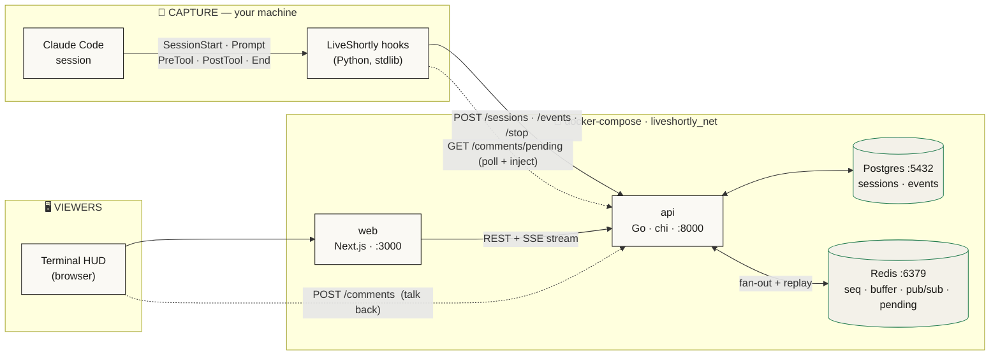
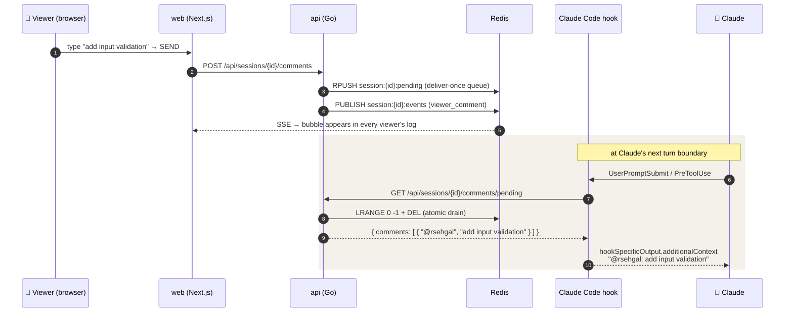
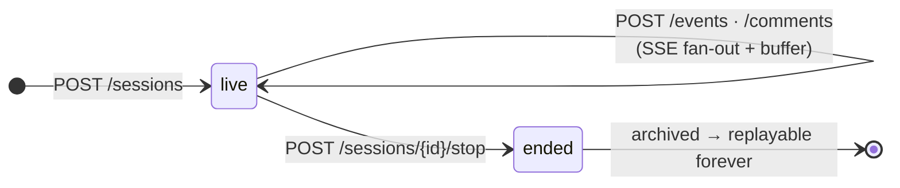
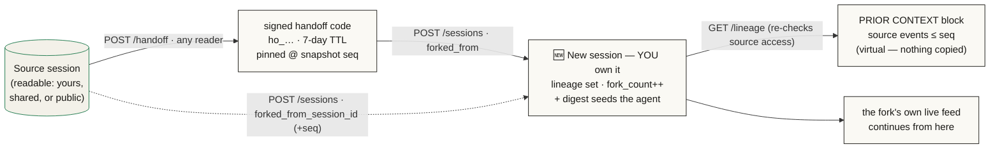
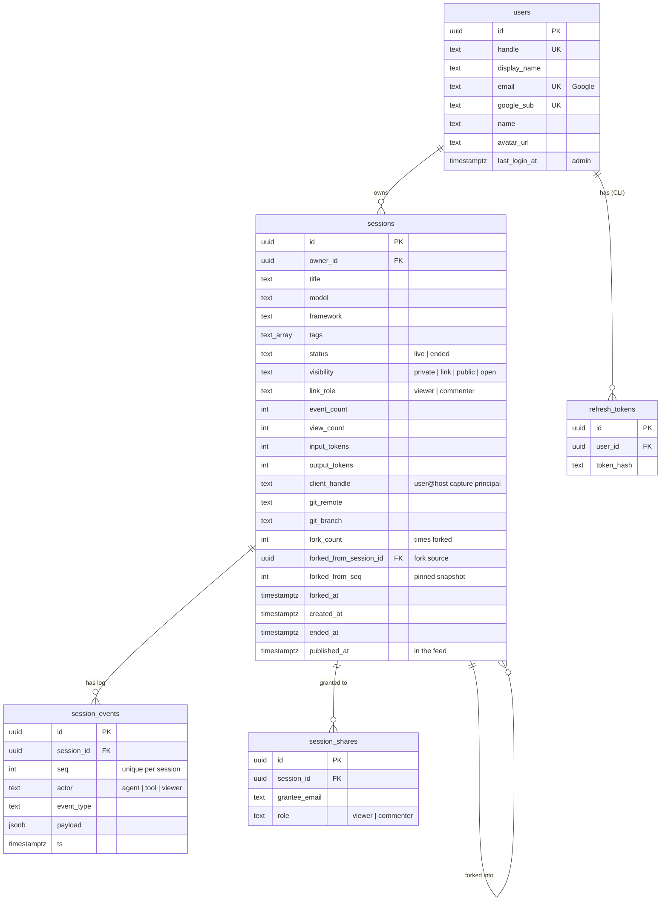

<div align="center">

# ◧ LiveShortly `_`

### Share your coding session **live** — watch it stream, replay every past run, and talk back to the agent from the browser.

A lean monorepo that turns any **Claude Code** session into a live, shareable, replayable stream — wrapped in a nerdy financial-terminal HUD. Self-host it, or use the live instance at **[liveshortly.com](https://liveshortly.com)**.

<br/>


<br/>

> **One concept: the `Session`.** It's `live` while you work and `ended` once you stop —
> with an ordered event log that streams in real time and replays forever.

</div>

<div align="center">


<sub>Capture on your machine → fan out through the docker-compose stack → watch & talk back from the browser.</sub>

</div>

---

## ✦ Table of Contents

- [Why](#-why)
- [Features](#-features)
- [Architecture](#-architecture)
- [The live loop (viewer ⇄ agent)](#-the-live-loop-viewer--agent)
- [Handoff & fork](#-handoff--fork)
- [Quickstart](#-quickstart)
- [Configuration](#-configuration)
- [API reference](#-api-reference)
- [Data model](#-data-model)
- [Capture: wiring Claude Code](#-capture-wiring-claude-code)
- [Design system](#-design-system)
- [Project layout](#-project-layout)
- [Auth & access control](#-auth--access-control)
- [Roadmap](#-roadmap)

---

## ✦ Why

Recordings of agent sessions are everywhere — but they're **dead**. You can't watch them
happen, you can't nudge the agent mid-run, and they rot in a gist.

**LiveShortly** makes a session a *living object*:

- 🔴 **Live** — viewers watch prompts, responses, tool calls and file writes appear in real time.
- 💬 **Two-way** — a viewer can type a message in the browser that gets **injected into the running Claude session**.
- ⏯ **Replayable** — every ended session is archived and plays back event-by-event.
- 🔎 **Discoverable** — a public feed, live counts, and search.
- 🔗 **Shareable** — sign in with Google, share a private link, or make a session public/open and **tweet it** — one click flips it public and drops a rich card in the timeline.

Self-host with `docker compose up`, or watch the live instance at **[liveshortly.com](https://liveshortly.com)**.

---

## ✦ Features

| | |
|---|---|
| 🎥 **Live streaming** | Server-Sent Events over a Redis pub/sub fan-out; late joiners replay the buffer and catch up instantly. |
| 💬 **Viewer → agent injection** | Browser messages queue in Redis and are injected into Claude via hook `additionalContext` — delivered **exactly once**. |
| 🖥️ **Terminal HUD** | A monospace, financial-terminal dashboard (light **and** dark): live UTC clock, big counters, hairline panels, pulsing `● LIVE`. |
| 🔁 **Replay** | Ended sessions persist their full event log and play back in order. |
| ⑃ **Handoff & fork** | Continue **any** session you can read — live or archived, even someone else's — as a **new session you own**, with any agent. A 7-day signed handoff code or a fork-by-id; the server hands back a deterministic digest that seeds the continuing agent. The original is untouched. |
| 🧬 **Prior-context view** | A forked session shows its source's **entire** prior history inline — a virtual, copy-on-write view (nothing is copied), rendered as a distinct **PRIOR CONTEXT** block above the fork's own feed. Access is re-checked on both fork and source. |
| 🤖 **Multi-agent capture** | First-class capture for **Claude Code** and **Codex** (plus Gemini / raw terminal), each labelled in the viewer. |
| 🏠 **Public landing feed** | A public home feed of published sessions — activity ticker, featured hero, `LIVE NOW` / `TRENDING` / `RECENTLY PUBLISHED` grids, browse-by-tag. No sign-in to watch. |
| 🔎 **Search + index** | Search the feed by title/snippet/tag; a signed-in HUD of your own + shared sessions with `TOTAL / LIVE NOW` stats. |
| 🔐 **Google sign-in** | Real auth is live: Google OAuth for the web (`ls_session` cookie) + a CLI **device flow** minting bearer/refresh tokens. |
| 🔗 **Sharing & visibility** | Per-session `private → link → public → open`: share to specific emails (viewer/commenter), a signed-in link, or an **open** link anyone can watch without an account. Publish to the discoverable feed. |
| 🐦 **Share to X + OG cards** | One click makes a session public and opens a pre-filled tweet; dynamic **Open Graph / Twitter cards** render the session (title, author, a real prompt line, stats) in the app's own theme. |
| 🛡️ **Admin portal** | A super-admin-only surface (email allowlist, gated at nav + route + API): app-wide stats, a user directory with last-login, and a filterable session browser. Aggregate metadata only. |
| 🪝 **Zero-touch capture** | Claude Code hooks (stdlib Python) auto-open a session and stream every prompt/tool/file event. |
| 🐳 **One command** | Postgres + Redis + Go API + Next.js web, all in `docker-compose.yml`. |

---

## ✦ Architecture



**How it flows**

1. **Capture** — Claude Code fires hooks; `SessionStart` opens a LiveShortly session, every prompt/tool/file event is `POST`ed to the API.
2. **Fan-out** — the API allocates an atomic `seq` (Redis `INCR`), persists to Postgres, buffers the event (Redis list), and `PUBLISH`es it.
3. **Watch** — the web app opens an **SSE** stream: it replays the buffer for late joiners, then streams live events with a 15s heartbeat.
4. **Talk back** — a viewer's message becomes a `viewer_comment` event (shown to all) **and** a queued item the hooks drain and inject into Claude.

---

## ✦ The live loop (viewer ⇄ agent)

The headline feature: a browser viewer steering the running CLI session.



> ⚠️ **Honest limit:** hooks only fire on Claude's own events. A viewer message lands at the
> **next** prompt or tool call — it does **not** wake an idle Claude. It's collaborative
> steering, not remote control.

### Session lifecycle



---

## ✦ Handoff & fork

*New in v4.0.0.* Pick up **any** session you can read — your own, a teammate's,
or an archived one — and continue it as a **brand-new session you own**, with any
agent. The original is never touched. Two ways in:

- **Handoff code** — `POST /api/sessions/{id}/handoff` mints a 7-day signed code
  (`ho_…`) pinned to a snapshot seq. Anyone who can read the session can mint one.
- **Fork by id** — redeem at `POST /api/sessions` with `forked_from` (a code) **or**
  `forked_from_session_id` (`+ forked_from_seq`, default latest).

The server re-checks read access for the **redeeming** principal, records the
lineage (`forked_from_session_id`, `forked_from_seq`, `forked_at`), bumps the
source's `fork_count`, and returns a deterministic **digest** (assembled from the
event log — **no LLM**) that seeds the continuing agent. The clone's own agent does
the comprehension.



**Prior context is a virtual, copy-on-write view.** `GET /api/sessions/{id}/lineage`
returns the source's events up to the pinned snapshot; the web renders them as a
distinct, collapsible **PRIOR CONTEXT** block **above** the fork's own feed —
nothing is physically duplicated. It's a human/replay surface; the agent is seeded
by the compact digest, not by replaying every prior turn into its context window.

> Each session numbers its own `seq` from 1, and the live feed is sorted by `seq`,
> so lineage is a **separate block** — never merged into the fork's timeline (that
> would scramble the order). RBAC is re-checked on **both** the fork and the
> source: no source access → events withheld (`restricted: true`); a deleted
> source → reference only.

---

## ✦ Quickstart

```bash
git clone git@github.com:liveshortly/liveshortly-server.git
cd LiveShortly
cp .env.example .env          # sensible defaults, no edits needed
docker compose up -d --build
```

| Service | URL | |
|---|---|---|
| 🖥️ **Web** | http://localhost:3000 | the terminal HUD |
| ⚙️ **API** | http://localhost:8000 | `GET /health` → `{"ok":true}` |
| 🐘 Postgres | `localhost:5432` | `sessions`, `session_events` |
| 🧠 Redis | `localhost:6379` | seq · buffer · pub/sub · pending |

> 🐘 **Port clash?** If you already run a local Postgres on `5432`, DBeaver/psql
> will hit *that* one (and fail with `role "liveshortly" does not exist`). Either
> stop it, or remap the container: set `POSTGRES_PORT=5433` in `.env`, `docker
> compose up -d postgres`, and connect DBeaver to `localhost:5433`. The api is
> unaffected — it reaches Postgres over the docker network, not the host port.

**Kick the tires without Claude:**

```bash
# open a session
ID=$(curl -s -X POST localhost:8000/api/sessions \
  -H 'content-type: application/json' \
  -d '{"title":"hello world","tags":["demo"]}' | jq -r .id)

# emit an event, then watch it live in another terminal:  curl -N localhost:8000/api/sessions/$ID/stream
curl -s -X POST localhost:8000/api/sessions/$ID/events \
  -H 'content-type: application/json' \
  -d '{"event_type":"prompt","payload":{"content":"build me a CLI"}}'

# talk back, then drain the queue (what the hook does):
curl -s -X POST localhost:8000/api/sessions/$ID/comments -d '{"message":"add tests!"}'
curl -s localhost:8000/api/sessions/$ID/comments/pending   # → the message, once
```

Open **http://localhost:3000** and your session is in the index.

### Sign in locally (Google OAuth)

The base stack boots with login **disabled** (no Google credentials). To exercise
real Google sign-in — **and live SSE streaming** — locally, run the stack behind
the local **nginx** front (`docker-compose.local.yml`), which serves web + api on
**one origin** `http://localhost:8080`, exactly like production.

> **Don't use plain `:3000` for a live session.** The base web server proxies
> `/api/*` through Next.js `rewrites`, which **buffer SSE** — the initial replay
> shows on refresh, but live events never stream in. nginx (`local.conf`) sets
> `proxy_buffering off`, so `:8080` streams correctly. It also gives OAuth + the
> `ls_session` cookie a single origin (split `:3000`/`:8000` drops the cookie).

**1.** Drop the OAuth secrets into a **gitignored** `.env.auth` — the api compose
service loads it automatically (`required: false`, so without it the api still
boots with auth off):

```bash
cat > .env.auth <<EOF
GOOGLE_CLIENT_ID=<your-client-id>.apps.googleusercontent.com
GOOGLE_CLIENT_SECRET=<your-client-secret>
SESSION_SECRET=$(openssl rand -hex 32)
EOF
```

`docker-compose.local.yml` pins `WEB_BASE_URL` / `OAUTH_ALLOWED_HOSTS` to
`localhost:8080` (overriding anything in `.env.auth`), so you don't set them here.

**2.** Bring up the full single-origin stack:

```bash
docker compose -f docker-compose.yml -f docker-compose.local.yml up -d --build
```

**3.** In the **Google Cloud Console** OAuth client (APIs & Services →
Credentials), add:

| Field | Value |
|---|---|
| Authorised JavaScript origin | `http://localhost:8080` |
| Authorised redirect URI | `http://localhost:8080/auth/google/callback` |

Then open **http://localhost:8080** (NOT `:3000`), click **Sign In**, and you land
back logged in — with live sessions streaming in real time.

---

## ✦ Configuration

All via `.env` (see [`.env.example`](.env.example)). The defaults just work.

| Var | Default | Notes |
|---|---|---|
| `WEB_PORT` | `3000` | host port for the web UI |
| `API_PORT` | `8000` | host port for the API (**container always listens on 8000**) |
| `POSTGRES_PORT` / `REDIS_PORT` | `5432` / `6379` | datastore host ports |
| `NEXT_PUBLIC_API_URL` | `http://localhost:8000` | **baked into the browser bundle at build time** ⚠️ |
| `API_INTERNAL_URL` | `http://api:8000` | SSR → API over the docker network |
| `CORS_ORIGINS` | `*` | comma-separated; `*` allows all |
| `DEFAULT_USER_HANDLE` | `you` | fallback principal handle for unattributed capture |
| `LIVESHORTLY_API_URL` | `http://localhost:8000` | where the capture hooks POST |

**Auth & admin** (optional — omitting the Google vars just disables login wiring):

| Var | Default | Notes |
|---|---|---|
| `GOOGLE_CLIENT_ID` / `GOOGLE_CLIENT_SECRET` | — | Google OAuth credentials; empty disables web/CLI login |
| `SESSION_SECRET` | — | signs the `ls_session` cookie + bearer/refresh JWTs |
| `WEB_BASE_URL` | — | canonical web origin (used for OAuth callback + share links) |
| `OAUTH_ALLOWED_HOSTS` | host of `WEB_BASE_URL` | comma-separated hostnames allowed to start/receive the OAuth callback |
| `SUPER_ADMIN_EMAILS` | two founders | comma-separated allowlist for the `/admin` surface |
| `NEXT_PUBLIC_SITE_URL` | `https://liveshortly.com` | absolute base for OG/canonical URLs (web) |

> ⚠️ **`NEXT_PUBLIC_*` is compile-time.** Change `NEXT_PUBLIC_API_URL` and you must
> **rebuild** the web image — a restart reuses the old baked URL:
> ```bash
> docker compose up -d --build web
> ```

---

## ✦ API reference

Base path `/api`. A single principal middleware resolves a **bearer JWT** or the **`ls_session`
cookie**; `/api/me`, `GET /feed`, `GET /sessions/{id}` and its stream accept an **anonymous**
caller (needed for `visibility="open"` sessions + the public feed), everything else requires a
principal. Admin endpoints additionally enforce the super-admin allowlist (`403` otherwise).

| Method | Endpoint | Body | Returns |
|---|---|---|---|
| `GET` | `/health` | — | `{ ok, version, ts }` |
| `GET` | `/api/me` | — | `{ authenticated, id?, email?, name?, is_admin? }` |
| `GET` | `/api/stats` | — | `{ total_sessions, live_now, ended, total_events }` |
| `GET` | `/api/feed?q=&cursor=&limit=` | — | published sessions (public) |
| `POST` | `/api/sessions` | `{ title?, model?, framework?, tags?, forked_from?, forked_from_session_id?, forked_from_seq? }` | `201` `Session` + `url` (+ `handoff` digest on a fork) |
| `GET` | `/api/sessions?scope=&status=&q=&limit=&offset=` | — | `{ results: Session[], total }` |
| `GET` | `/api/sessions/{id}` | — | `Session` + `events[]` + `forked_from` + `forker_count` (bumps `view_count`) |
| `POST` | `/api/sessions/{id}/handoff` | `{ seq? }` | `{ code, session_id, snapshot_seq, expires_at, command }` *(any reader)* |
| `GET` | `/api/sessions/{id}/lineage` | — | `{ source, snapshot_seq, events[], restricted }` — a fork's prior context *(any reader)* |
| `PATCH` | `/api/sessions/{id}` | `{ title?, visibility?, link_role? }` | `Session` *(owner)* |
| `POST` | `/api/sessions/{id}/events` | `{ event_type, payload, actor? }` | `201` `Event` |
| `GET` | `/api/sessions/{id}/stream` | — | **SSE** event stream |
| `POST` | `/api/sessions/{id}/stop` | — | `Session` (`ended`) |
| `POST` | `/api/sessions/{id}/{publish\|unpublish}` | — | `Session` *(owner — feed on/off)* |
| `POST` | `/api/sessions/{id}/comments` | `{ message }` | `201` `Event` *(live only)* |
| `GET` | `/api/sessions/{id}/comments/pending` | — | `{ comments[] }` *(drains once)* |
| `POST` / `GET` | `/api/sessions/{id}/decision` | `{ decision }` | live allow/deny of a CLI permission prompt |
| `POST` | `/api/sessions/{id}/typing` | — | viewer "is typing" presence ping |
| `POST` `GET` `DELETE` | `/api/sessions/{id}/shares[/{shareId}]` | `{ email, role }` | share grants *(owner)* |
| `GET` | `/api/admin/stats` | — | app-wide aggregate metrics *(super-admin)* |
| `GET` | `/api/admin/users` | — | user directory + last-login *(super-admin)* |
| `GET` | `/api/admin/sessions?filter=all\|live\|ended\|public` | — | all sessions, metadata only *(super-admin)* |

Web-only auth routes live at the root (proxied by nginx): `/auth/google/{login,callback}`,
`/auth/logout`, `/auth/token`, and the CLI device flow `/auth/device/{start,approve,poll}` + `/device`.

<details>
<summary><b>SSE frame protocol</b></summary>

```text
data: {"type":"connected","session_id":"…","status":"live"}     ← handshake
data: { …Event… }                                               ← replayed buffer, in seq order
data: { …Event… }                                               ← then live events
: ping                                                          ← every 15s heartbeat
data: {"type":"session_ended","session_id":"…"}                 ← on stop, then close
```
Events are de-duplicated by `id`, so a buffered event is never delivered twice.
</details>

<details>
<summary><b>Redis keys</b></summary>

| Key | Type | Purpose |
|---|---|---|
| `session:{id}:seq` | counter | atomic `INCR` → next event `seq` |
| `session:{id}:buffer` | list | event JSON for late-joiner replay |
| `session:{id}:events` | pub/sub | live fan-out to SSE subscribers |
| `session:{id}:pending` | list | viewer messages awaiting hook drain (TTL 2h) |
</details>

---

## ✦ Data model



**Event types:** `prompt` · `response` · `tool_call` · `file_write` · `output` · `viewer_comment` · `input_requested` · `viewer_decision`

**Additive migrations** run at boot (`store.Migrate`) — the SQL entrypoint scripts only run on a fresh volume, so post-launch columns (visibility, tokens, git, `published_at`, `last_login_at`, …) are added there idempotently.

---

## ✦ Capture: wiring Claude Code

Make any real Claude Code session stream into LiveShortly. Merge
[`cli/settings.example.json`](cli/settings.example.json) into your `~/.claude/settings.json`
(or a project `.claude/settings.json`), pointing the commands at `cli/hooks/`.

| Hook | Script | Does |
|---|---|---|
| `SessionStart` | `session_start.py` | opens a LiveShortly session, prints the share URL |
| `UserPromptSubmit` | `user_prompt_submit.py` | emits your `prompt` **+ injects** pending viewer messages |
| `PreToolUse` | `pre_tool_use.py` + `comments_inject.py` | emits `tool_call` **+ mid-turn** viewer injection |
| `PostToolUse` | `post_tool_use.py` | emits `file_write` / `output` |
| `SessionEnd` | `session_end.py` | stops + archives the session |

> Hooks are stdlib-only Python, fire-and-forget, and **never block or crash your session**
> even if the API is down. Then **start a fresh Claude session** (hooks load at start, and
> Claude Code will ask you to trust them). See [`cli/README.md`](cli/README.md).

---

## ✦ Design system

A financial-terminal HUD — monospace everything, hairline boxes, UPPERCASE tracked labels,
big tabular numbers, a pulsing `● LIVE`, a live UTC clock. Fully **themeable** via CSS variables
(`--bg`, `--panel`, `--ink`, `--green`, …) with **light** and **dark** palettes; new visitors
default to dark, and the choice persists (light / dark / system).

| Token | Light | Dark | | Token | Light | Dark |
|---|---|---|---|---|---|---|
| bg | `#e7e8ea` | `#1e2123` | | ink | `#1b1c1e` | `#e9ebed` |
| panel | `#f3f4f5` | `#282c2f` | | 🟢 live | `#1f7a4d` | `#54b885` |
| hairline | `#d0d2d5` | `#3d4247` | | 🔴 ended | `#c0392b` | `#e7705f` |
| strong | `#1b1c1e` | `#edeff1` | | ★ admin | `#7c3aed` | `#b794f6` |

Font: `'JetBrains Mono', 'IBM Plex Mono', ui-monospace, Menlo, monospace` (also base64-embedded
for the server-rendered OG cards). Nav tabs: **FEED · MY HUD · PROFILE** (+ **ADMIN** in its own
violet accent for super-admins). The admin surface reuses the HUD but carries the admin accent
so it's always obvious you're in admin mode.

---

## ✦ Project layout

```
LiveShortly/
├── api/                    # Go · chi · pgx · go-redis
│   ├── cmd/server/         #   entrypoint + router
│   ├── internal/
│   │   ├── config/         #   env config (incl. super-admin allowlist)
│   │   ├── auth/           #   principal middleware (bearer / cookie / anon)
│   │   ├── websession/     #   JWT issue/verify for cookie + bearer/refresh
│   │   ├── handlers/       #   sessions · events · stream · comments · feed
│   │   │                   #   · shares · authweb (Google) · device · stats · admin
│   │   ├── store/          #   pgx data access + boot migrations
│   │   ├── bus/            #   redis: seq · buffer · pub/sub · pending
│   │   └── storage/        #   filesystem archive
│   └── infra/postgres/     #   init.sql + 002-auth.sql
├── web/                    # Next.js · App Router · Tailwind v4
│   ├── app/                #   / (feed) · hud · profile · admin{,/users,/sessions}
│   │   ├── session/[id]/   #   viewer (client) + server metadata + opengraph-image
│   │   ├── replay|story|compose/[id]/   #   alternate session views
│   │   └── opengraph-image · twitter-image
│   ├── components/         #   HudHeader · EventStream · Feed · SessionCard
│   │                       #   · ShareToTwitter · PublicLinkDialog · AuthGate …
│   └── lib/                #   api.ts · ogCard/ogFonts · useAdminGuard
├── cli/                    # Claude Code capture hooks (Python, stdlib)
│   ├── hooks/
│   └── settings.example.json
├── design/                 # offline HTML mockups (UI/UX reference)
├── deploy/                 # systemd units, nginx conf, box provisioning
├── docker-compose.yml · docker-compose.local.yml   # local dev only — prod runs systemd
├── CONTRACT.md             # the binding API + design spec
└── AUTH.md                 # auth endpoints, tokens, sharing model
```

---

## ✦ Auth & access control

Auth is **live** (see [`AUTH.md`](AUTH.md) for the binding spec). Every `/api` route except
`/api/me`, the public feed, and open-session reads resolves a principal through one middleware:

- 🔑 **Web** — Google OAuth (`/auth/google/login` → callback) sets an `ls_session` HttpOnly cookie.
- 🖥️ **CLI** — a device flow (`/auth/device/start` → poll) mints access + refresh JWTs written to `~/.liveshortly/credentials.json`; hooks auto-refresh on expiry.
- 👁️ **Anonymous** — `visibility="open"` sessions and the published feed are readable with no account, so a shared link (or a Twitter card crawler) just works.

**Authorization** (`handlers/authz.go`): owner → full access; a `session_shares` grant → viewer/commenter;
`visibility=link|public` → any signed-in user with the URL; `visibility=open` → anyone at all.
**Super-admins** are an email allowlist (`SUPER_ADMIN_EMAILS`) checked at the nav, the web route,
and the API — the `/admin` endpoints return `403` to everyone else.

---

## ✦ Roadmap

- [x] Google sign-in + CLI device-flow bearer/refresh tokens
- [x] Per-session visibility (private / link / public / open) + email sharing
- [x] Public feed, Share-to-X, Open Graph / Twitter cards
- [x] Super-admin portal (stats · user directory · session browser)
- [x] Session **handoff & fork** — continue any readable session as a new owned one
- [x] **Prior-context** full-history view for forks (virtual, copy-on-write)
- [x] Multi-agent capture (Claude Code · **Codex** · Gemini · terminal)
- [ ] Per-user **quotas** (storage + concurrent live sessions) — launch-blocking
- [ ] `live lineage <id>` — CLI scrollback of a fork's prior context
- [ ] Semantic search over session content
- [ ] Persisted Dev Story / blog composer (the UI shells exist)
- [ ] Replay timeline + chapters (video-style scrubber)
- [ ] Multi-agent rooms (presence, turn-taking)

---

<div align="center">

**Built fast, built lean.** · Postgres + Redis + Go + Next.js · `docker compose up`

<sub>🤖 Generated with <a href="https://claude.com/claude-code">Claude Code</a></sub>

</div>
