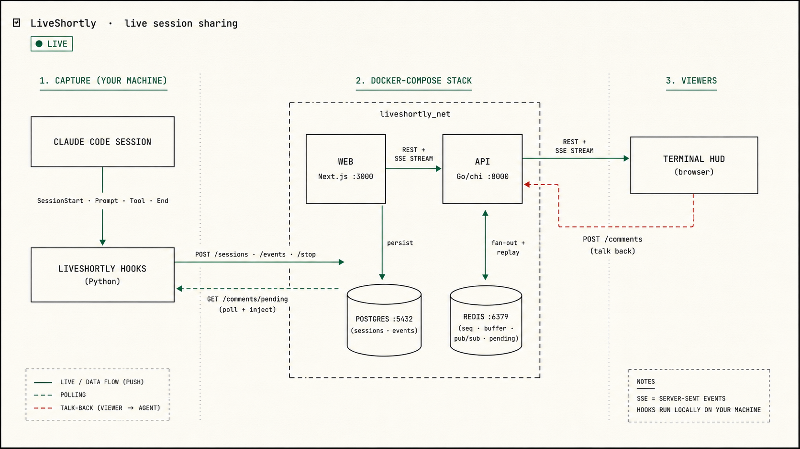
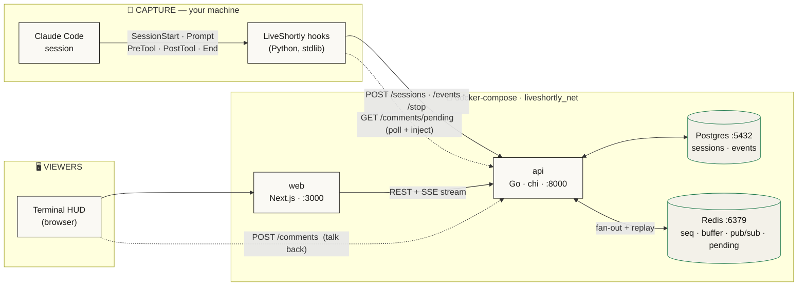
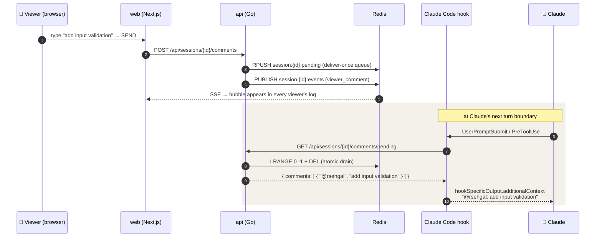
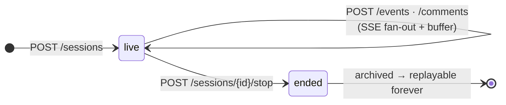
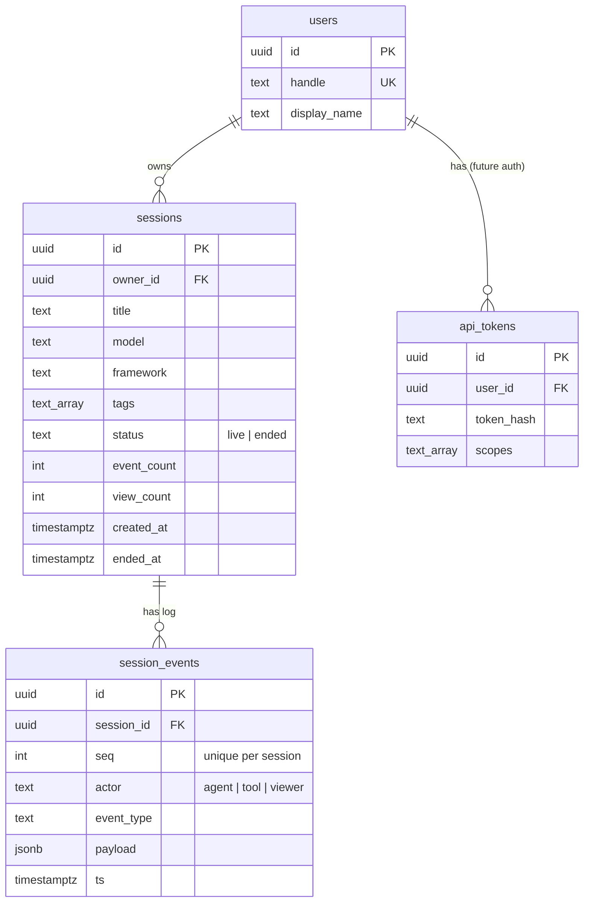

<div align="center">

# ◧ LiveShortly `_`

### Share your coding session **live** — watch it stream, replay every past run, and talk back to the agent from the browser.

A lean, self-hosted monorepo that turns any **Claude Code** session into a live, shareable, replayable stream — wrapped in a nerdy financial-terminal HUD.

<br/>


<br/>

> **One concept: the `Session`.** It's `live` while you work and `ended` once you stop —
> with an ordered event log that streams in real time and replays forever.

</div>

<!--
  HERO IMAGE: drop a beautified architecture render here once generated.
  
-->

---

## ✦ Table of Contents

- [Why](#-why)
- [Features](#-features)
- [Architecture](#-architecture)
- [The live loop (viewer ⇄ agent)](#-the-live-loop-viewer--agent)
- [Quickstart](#-quickstart)
- [Configuration](#-configuration)
- [API reference](#-api-reference)
- [Data model](#-data-model)
- [Capture: wiring Claude Code](#-capture-wiring-claude-code)
- [Design system](#-design-system)
- [Project layout](#-project-layout)
- [Auth — built for later](#-auth--built-for-later)
- [Roadmap](#-roadmap)

---

## ✦ Why

Recordings of agent sessions are everywhere — but they're **dead**. You can't watch them
happen, you can't nudge the agent mid-run, and they rot in a gist.

**LiveShortly** makes a session a *living object*:

- 🔴 **Live** — viewers watch prompts, responses, tool calls and file writes appear in real time.
- 💬 **Two-way** — a viewer can type a message in the browser that gets **injected into the running Claude session**.
- ⏯ **Replayable** — every ended session is archived and plays back event-by-event.
- 🔎 **Discoverable** — a HUD of all sessions, live counts, and full-text-ish search.

No SaaS, no account. `docker compose up` and it's yours.

---

## ✦ Features

| | |
|---|---|
| 🎥 **Live streaming** | Server-Sent Events over a Redis pub/sub fan-out; late joiners replay the buffer and catch up instantly. |
| 💬 **Viewer → agent injection** | Browser messages queue in Redis and are injected into Claude via hook `additionalContext` — delivered **exactly once**. |
| 🖥️ **Terminal HUD** | A light, monospace, financial-terminal dashboard: live UTC clock, big counters, hairline panels, pulsing `● LIVE`. |
| 🔁 **Replay** | Ended sessions persist their full event log and play back in order. |
| 🔎 **Search + index** | `LIVE` and `SESSIONS` tabs, search by title/tag, live `TOTAL / LIVE NOW` stats. |
| 🪝 **Zero-touch capture** | Claude Code hooks (stdlib Python) auto-open a session and stream every prompt/tool/file event. |
| 🔐 **Auth-ready** | `owner_id` on every session + an unused `api_tokens` table + a single middleware seam. Flip it on without a migration. |
| 🐳 **One command** | Postgres + Redis + Go API + Next.js web, all in `docker-compose.yml`. |

---

## ✦ Architecture



**How it flows**

1. **Capture** — Claude Code fires hooks; `SessionStart` opens a LiveShortly session, every prompt/tool/file event is `POST`ed to the API.
2. **Fan-out** — the API allocates an atomic `seq` (Redis `INCR`), persists to Postgres, buffers the event (Redis list), and `PUBLISH`es it.
3. **Watch** — the web app opens an **SSE** stream: it replays the buffer for late joiners, then streams live events with a 15s heartbeat.
4. **Talk back** — a viewer's message becomes a `viewer_comment` event (shown to all) **and** a queued item the hooks drain and inject into Claude.

---

## ✦ The live loop (viewer ⇄ agent)

The headline feature: a browser viewer steering the running CLI session.



> ⚠️ **Honest limit:** hooks only fire on Claude's own events. A viewer message lands at the
> **next** prompt or tool call — it does **not** wake an idle Claude. It's collaborative
> steering, not remote control.

### Session lifecycle



---

## ✦ Quickstart

```bash
git clone git@github.com:resapce/LiveShortly.git
cd LiveShortly
cp .env.example .env          # sensible defaults, no edits needed
docker compose up -d --build
```

| Service | URL | |
|---|---|---|
| 🖥️ **Web** | http://localhost:3000 | the terminal HUD |
| ⚙️ **API** | http://localhost:8000 | `GET /health` → `{"ok":true}` |
| 🐘 Postgres | `localhost:5432` | `sessions`, `session_events` |
| 🧠 Redis | `localhost:6379` | seq · buffer · pub/sub · pending |

**Kick the tires without Claude:**

```bash
# open a session
ID=$(curl -s -X POST localhost:8000/api/sessions \
  -H 'content-type: application/json' \
  -d '{"title":"hello world","tags":["demo"]}' | jq -r .id)

# emit an event, then watch it live in another terminal:  curl -N localhost:8000/api/sessions/$ID/stream
curl -s -X POST localhost:8000/api/sessions/$ID/events \
  -H 'content-type: application/json' \
  -d '{"event_type":"prompt","payload":{"content":"build me a CLI"}}'

# talk back, then drain the queue (what the hook does):
curl -s -X POST localhost:8000/api/sessions/$ID/comments -d '{"message":"add tests!"}'
curl -s localhost:8000/api/sessions/$ID/comments/pending   # → the message, once
```

Open **http://localhost:3000** and your session is in the index.

---

## ✦ Configuration

All via `.env` (see [`.env.example`](.env.example)). The defaults just work.

| Var | Default | Notes |
|---|---|---|
| `WEB_PORT` | `3000` | host port for the web UI |
| `API_PORT` | `8000` | host port for the API (**container always listens on 8000**) |
| `POSTGRES_PORT` / `REDIS_PORT` | `5432` / `6379` | datastore host ports |
| `NEXT_PUBLIC_API_URL` | `http://localhost:8000` | **baked into the browser bundle at build time** ⚠️ |
| `API_INTERNAL_URL` | `http://api:8000` | SSR → API over the docker network |
| `CORS_ORIGINS` | `*` | comma-separated; `*` allows all |
| `DEFAULT_USER_HANDLE` | `you` | the principal until real auth lands |
| `LIVESHORTLY_API_URL` | `http://localhost:8000` | where the capture hooks POST |

> ⚠️ **`NEXT_PUBLIC_*` is compile-time.** Change `NEXT_PUBLIC_API_URL` and you must
> **rebuild** the web image — a restart reuses the old baked URL:
> ```bash
> docker compose up -d --build web
> ```

---

## ✦ API reference

Base path `/api`. All writes pass through the auth middleware → the default principal.

| Method | Endpoint | Body | Returns |
|---|---|---|---|
| `GET` | `/health` | — | `{ ok, ts }` |
| `GET` | `/api/stats` | — | `{ total_sessions, live_now, ended, total_events }` |
| `POST` | `/api/sessions` | `{ title?, model?, framework?, tags? }` | `201` `Session` + `url` |
| `GET` | `/api/sessions?status=&q=&limit=&offset=` | — | `{ results: Session[], total }` |
| `GET` | `/api/sessions/{id}` | — | `Session` + `events[]` (bumps `view_count`) |
| `POST` | `/api/sessions/{id}/events` | `{ event_type, payload, actor? }` | `201` `Event` |
| `GET` | `/api/sessions/{id}/stream` | — | **SSE** event stream |
| `POST` | `/api/sessions/{id}/stop` | — | `Session` (`ended`) |
| `POST` | `/api/sessions/{id}/comments` | `{ message }` | `201` `Event` *(live only)* |
| `GET` | `/api/sessions/{id}/comments/pending` | — | `{ comments[] }` *(drains once)* |

<details>
<summary><b>SSE frame protocol</b></summary>

```text
data: {"type":"connected","session_id":"…","status":"live"}     ← handshake
data: { …Event… }                                               ← replayed buffer, in seq order
data: { …Event… }                                               ← then live events
: ping                                                          ← every 15s heartbeat
data: {"type":"session_ended","session_id":"…"}                 ← on stop, then close
```
Events are de-duplicated by `id`, so a buffered event is never delivered twice.
</details>

<details>
<summary><b>Redis keys</b></summary>

| Key | Type | Purpose |
|---|---|---|
| `session:{id}:seq` | counter | atomic `INCR` → next event `seq` |
| `session:{id}:buffer` | list | event JSON for late-joiner replay |
| `session:{id}:events` | pub/sub | live fan-out to SSE subscribers |
| `session:{id}:pending` | list | viewer messages awaiting hook drain (TTL 2h) |
</details>

---

## ✦ Data model



**Event types:** `prompt` · `response` · `tool_call` · `file_write` · `output` · `viewer_comment`

---

## ✦ Capture: wiring Claude Code

Make any real Claude Code session stream into LiveShortly. Merge
[`cli/settings.example.json`](cli/settings.example.json) into your `~/.claude/settings.json`
(or a project `.claude/settings.json`), pointing the commands at `cli/hooks/`.

| Hook | Script | Does |
|---|---|---|
| `SessionStart` | `session_start.py` | opens a LiveShortly session, prints the share URL |
| `UserPromptSubmit` | `user_prompt_submit.py` | emits your `prompt` **+ injects** pending viewer messages |
| `PreToolUse` | `pre_tool_use.py` + `comments_inject.py` | emits `tool_call` **+ mid-turn** viewer injection |
| `PostToolUse` | `post_tool_use.py` | emits `file_write` / `output` |
| `SessionEnd` | `session_end.py` | stops + archives the session |

> Hooks are stdlib-only Python, fire-and-forget, and **never block or crash your session**
> even if the API is down. Then **start a fresh Claude session** (hooks load at start, and
> Claude Code will ask you to trust them). See [`cli/README.md`](cli/README.md).

---

## ✦ Design system

The web is a **light** financial-terminal HUD — monospace everything, hairline boxes,
UPPERCASE tracked labels, big tabular numbers, a pulsing `● LIVE`, a live UTC clock.

| Token | Value | | Token | Value |
|---|---|---|---|---|
| paper | `#f3f1e9` | | ink | `#1a1916` |
| panel | `#faf9f4` | | muted | `#6c6a5e` |
| hairline | `#d9d6c9` | | 🟢 live / up | `#1f7a4d` |
| strong border | `#1c1b17` | | 🔴 ended / down | `#c0392b` |

Font: `'JetBrains Mono', 'IBM Plex Mono', ui-monospace, Menlo, monospace`.
Tabs are deliberately minimal: **LIVE** · **SESSIONS** + search. Nothing else.

---

## ✦ Project layout

```
LiveShortly/
├── api/                    # Go · chi · pgx · go-redis
│   ├── cmd/server/         #   entrypoint + router
│   ├── internal/
│   │   ├── auth/           #   principal middleware (auth seam)
│   │   ├── handlers/       #   sessions · events · stream · stop · comments · stats
│   │   ├── store/          #   pgx data access
│   │   ├── bus/            #   redis: seq · buffer · pub/sub · pending
│   │   └── storage/        #   filesystem archive
│   └── infra/postgres/init.sql
├── web/                    # Next.js · App Router · Tailwind v4
│   ├── app/                #   page (HUD + tabs) · session/[id] (viewer)
│   ├── components/         #   HudHeader · Clock · TabNav · SessionTable · EventStream …
│   └── lib/api.ts
├── cli/                    # Claude Code capture hooks (Python, stdlib)
│   ├── hooks/
│   └── settings.example.json
├── docker-compose.yml
└── CONTRACT.md             # the binding API + design spec
```

---

## ✦ Auth — built for later

There's no auth today: every request maps to `DEFAULT_USER_HANDLE`. But the seam is real,
so turning it on is a code change, **not** a migration:

- 🧩 `sessions.owner_id` is populated from day one
- 🧩 an unused `api_tokens` table (`token_hash`, `scopes`) is already in the schema
- 🧩 a single `api/internal/auth` middleware resolves the principal — Bearer-token validation slots in there with a marked `TODO`

---

## ✦ Roadmap

- [ ] Bearer-token auth (the seam is ready)
- [ ] Per-session visibility (public / unlisted / private)
- [ ] Semantic search over session content
- [ ] Multi-agent rooms (presence, turn-taking)
- [ ] A standalone CLI viewer (`liveshortly watch <id>`)

---

<div align="center">

**Built fast, built lean.** · Postgres + Redis + Go + Next.js · `docker compose up`

<sub>🤖 Generated with <a href="https://claude.com/claude-code">Claude Code</a></sub>

</div>
