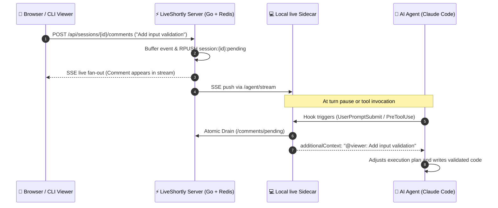
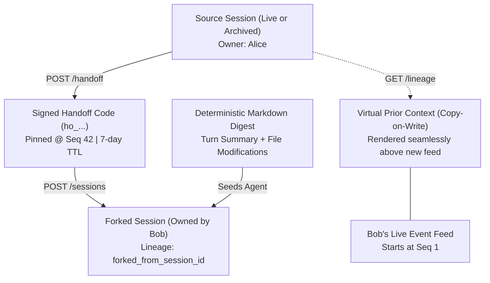
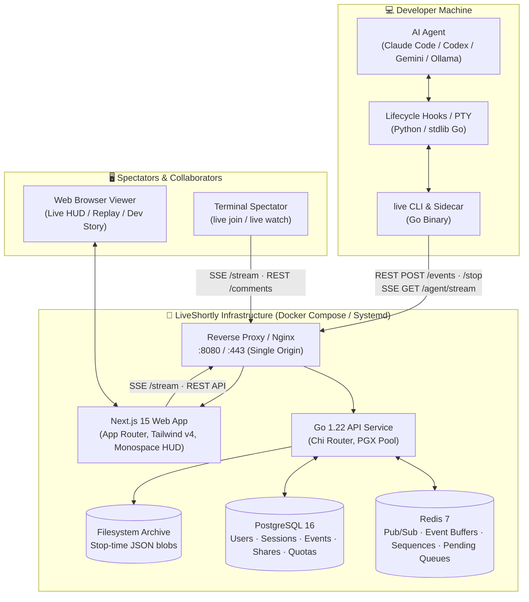
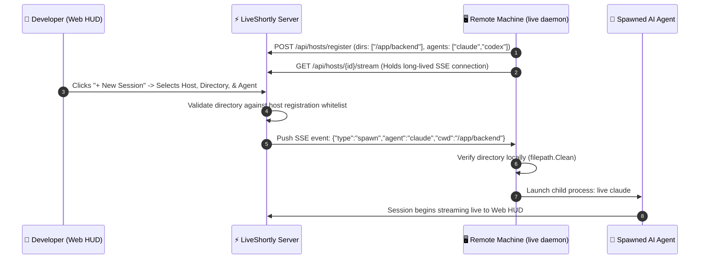

# ◧ LiveShortly Platform Overview & Architecture Guide

> **LiveShortly is the open-source platform for streaming, sharing, replaying, and collaboratively steering AI coding sessions in real time.**
> 
> *Put `live` in front of your coding agent (`live claude`, `live codex`, `live gemini`, `live agy`) — a shareable URL is generated instantly. Viewers watch every prompt, tool call, command output, and file diff as it happens, talk back to the running agent mid-session, approve tool permissions remotely from the web or terminal, and hand off or fork sessions with full deterministic lineage.*

---

## ✦ Table of Contents

1. [Executive Summary & Core Value Proposition](#1-executive-summary--core-value-proposition)
2. [Why LiveShortly: Moving Beyond Dead Session Logs](#2-why-liveshortly-moving-beyond-dead-session-logs)
3. [All Solved Use Cases (Deep Dive)](#3-all-solved-use-cases-deep-dive)
   - [Use Case 1: Real-Time Live Streaming & Interactive Spectating](#use-case-1-real-time-live-streaming--interactive-spectating)
   - [Use Case 2: Bidirectional Human-in-the-Loop Steering ("Talk Back")](#use-case-2-bidirectional-human-in-the-loop-steering-talk-back)
   - [Use Case 3: Remote Tool Approval & Permission Gating](#use-case-3-remote-tool-approval--permission-gating)
   - [Use Case 4: Asynchronous Code Review, Auditing, & High-Fidelity Replays](#use-case-4-asynchronous-code-review-auditing--high-fidelity-replays)
   - [Use Case 5: Session Handoff, Forking, & Lineage Continuity](#use-case-5-session-handoff-forking--lineage-continuity)
   - [Use Case 6: Browser-Initiated Remote Execution (`live daemon` & Hosts)](#use-case-6-browser-initiated-remote-execution-live-daemon--hosts)
   - [Use Case 7: Universal Multi-Agent Support & Fallback Architecture](#use-case-7-universal-multi-agent-support--fallback-architecture)
   - [Use Case 8: Terminal-to-Terminal Collaboration (`live join` & `live watch`)](#use-case-8-terminal-to-terminal-collaboration-live-join--live-watch)
   - [Use Case 9: Engineering Storytelling, Blogging, & Social Sharing](#use-case-9-engineering-storytelling-blogging--social-sharing)
   - [Use Case 10: Access Control, Quota Governance, & Enterprise Self-Hosting](#use-case-10-access-control-quota-governance--enterprise-self-hosting)
4. [High-Level System Architecture](#4-high-level-system-architecture)
5. [The Live Loop: Real-Time Fan-Out & Message Injection](#5-the-live-loop-real-time-fan-out--message-injection)
6. [Handoff, Forking, & Virtual Prior-Context Engine](#6-handoff-forking--virtual-prior-context-engine)
7. [Remote Daemon & Host Execution Architecture](#7-remote-daemon--host-execution-architecture)
8. [CLI Reference (`live`)](#8-cli-reference-live)
9. [API & Protocol Specification](#9-api--protocol-specification)
10. [Data Model & Database Schema](#10-data-model--database-schema)
11. [Identity, Auth, & Sharing Permissions](#11-identity-auth--sharing-permissions)
12. [Resource Governance & Quotas](#12-resource-governance--quotas)
13. [Self-Hosting & Deployment Guide](#13-self-hosting--deployment-guide)
14. [Frequently Asked Questions (FAQ)](#14-frequently-asked-questions-faq)

---

## 1. Executive Summary & Core Value Proposition

Modern software engineering is transitioning rapidly toward **Agentic AI Coding Assistants** (e.g., Anthropic's Claude Code, OpenAI Codex CLI, Google Gemini CLI, Ollama local models, and custom agent runtimes). However, existing developer tooling treats AI coding sessions as private, transient, and siloed terminal operations.

**LiveShortly transforms AI coding sessions into living, collaborative, auditable, and replayable cloud objects.**

```
+-----------------------------------------------------------------------------------------+
|                                    LIVESHORTLY PLATFORM                                 |
+--------------------+------------------------------------+-------------------------------+
|     CAPTURE        |             FAN-OUT                |            SURFACES           |
|                    |                                    |                               |
|  live claude       |  Go 1.22 API + Redis 7 Pub/Sub     |  Monospace Terminal Web HUD   |
|  live codex        |  PostgreSQL 16 Event Persistence   |  Terminal-to-Terminal TUI     |
|  live gemini       |  Atomic Sequences (INCR)           |  Remote Permission Popups     |
|  live daemon       |  Replay Buffer for Late Joiners    |  Dev Story Narrative Reports  |
+--------------------+------------------------------------+-------------------------------+
```

### Key Pillars:
- **Instant Opt-In Capture:** No background daemons running without your consent. Simply type `live claude` instead of `claude`.
- **Sub-100ms Event Streaming:** SSE (Server-Sent Events) over Redis pub/sub pushes structured prompts, tool invocations, bash runs, and file diffs.
- **Bi-Directional Steering:** Viewers watching in the browser or terminal can inject feedback into the agent mid-task.
- **Cross-Agent Handoff & Forking:** Take any session, generate a snapshot handoff digest, and continue it on a different machine or with a different model without context window pollution.
- **Remote Host Orchestration:** Start agent sessions on remote Linux workstations or MacBooks directly from the browser with sandboxed directory allowlists.
- **Zero-Friction Sharing & Replay:** Private links, Google Drive-style access grants, 1-click publishing to the public feed, and server-rendered dynamic Open Graph cards.

---

## 2. Why LiveShortly: Moving Beyond Dead Session Logs

| Legacy AI Coding Workflows | The LiveShortly Way |
|---|---|
| **Isolated Execution:** The session only exists on the local laptop screen. | **Real-Time Broadcast:** Streamed instantly to teammates, mentors, or livestream audiences. |
| **Dead Artifacts:** When finished, transcripts rot in terminal scrollback or static gists. | **Interactive Replays:** Event-by-event playback preserving token metrics, tool outputs, and diffs. |
| **Passive Observation:** Spectators cannot intervene when an agent goes down the wrong path. | **Live Steering:** Comments injected directly into the agent's turn context (`additionalContext`). |
| **Tethered to the Machine:** Stalled on terminal permission prompts when away from desk. | **Multi-Device Approvals:** Allow or deny tool executions from mobile phone, web browser, or tmux. |
| **Siloed Context:** Passing a session to a colleague requires messy copy-pasting of prompt logs. | **Cryptographic Handoff:** Deterministic briefing bundle and copy-on-write virtual prior context. |
| **Manual Dev Notes:** Engineering blogs and post-mortems require tedious manual write-ups. | **Dev Story Generation:** Automatic turn synthesis and statistical epilogue for blog publishing. |

---

## 3. All Solved Use Cases (Deep Dive)

### Use Case 1: Real-Time Live Streaming & Interactive Spectating

#### The Problem
Pair programming with AI often requires sharing progress with teammates, junior developers, or public audiences. Screen-sharing tools (Zoom, Discord, Twitch) consume significant bandwidth, pixelate text, blur code diffs, provide no interactive inspection of tool calls, and prevent late joiners from reviewing what happened earlier.

#### The Solution
- Run `live claude` (or `live <agent>`). A lightweight Go sidecar creates a session and returns a clean URL: `https://liveshortly.com/session/<id>`.
- The Web UI renders a **Financial-Terminal HUD** (light and dark mode) showing live turns, tool calls, file diffs (`+`/`-`), and command outputs in crisp monospace typography.
- Late joiners connect via SSE, automatically replay the Redis sequence buffer to catch up from seq 1, and seamlessly transition into the live real-time stream.
- Live presence tracks active watchers via ephemeral Redis ZSETs and displays a pulsating `● LIVE` badge and live UTC clock.

---

### Use Case 2: Bidirectional Human-in-the-Loop Steering ("Talk Back")

#### The Problem
When watching an agent code, viewers frequently spot edge cases, architectural mistakes, or missing unit tests. In traditional setups, the viewer must notify the operator in a separate chat app, interrupting the developer's flow.

#### The Solution
- Anyone with commenter access types feedback directly into the web session composer or terminal (`live join <id>`).
- The message is pushed to Redis (`session:{id}:pending` and `session:{id}:agent`).
- The local `live` sidecar intercepts the comment and injects it into Claude's turn context via `hookSpecificOutput.additionalContext` (prefixed with `@viewer: message`).
- Delivered **exactly once** at the next natural turn boundary or tool execution pause without interrupting active model generation.



---

### Use Case 3: Remote Tool Approval & Permission Gating

#### The Problem
Security-conscious developers restrict AI agents from modifying files, executing bash scripts, or downloading remote packages without explicit approval. However, if the developer steps away from their laptop (e.g., grabbing coffee or checking from a phone), the agent halts on a terminal permission prompt indefinitely.

#### The Solution
- `live` intercepts tool permission requests (`Notification` hook / tool evaluation).
- An amber permission banner appears across the web session viewer and any joined terminal CLI.
- The session owner (or authorized commenter) can tap **Allow**, **Deny**, or **Allow Always** from their smartphone browser or secondary screen.
- First response wins; the local sidecar feeds the decision back to the agent in under 1 second.
- If tmux is installed on the host machine (`LIVE_TMUX=1`), Claude runs in an isolated tmux session and displays a clean floating popup in the terminal without breaking the TUI.
- Safe timeouts: Unanswered prompts automatically deny after ~8 minutes.

---

### Use Case 4: Asynchronous Code Review, Auditing, & High-Fidelity Replays

#### The Problem
Pull request reviews only show the finished code. Reviewers cannot see what alternatives the AI attempted, how it debugged syntax errors, what bash tests were executed, or how many tokens were consumed.

#### The Solution
- When a session ends (`Ctrl+C` or `live stop <id>`), the event buffer is sealed and persisted in PostgreSQL and disk storage.
- The session URL permanently converts into a searchable, interactive **Replay**.
- Reviewers inspect the full chronological turn history:
  - Exact user prompts.
  - File diffs with syntax coloring and line-by-line delta counts.
  - Full tool input arguments and stdout/stderr outputs.
  - Model metrics: Token usage (input vs. output tokens), execution duration, and underlying LLM version.

---

### Use Case 5: Session Handoff, Forking, & Lineage Continuity

#### The Problem
A developer finishes an initial prototype with Claude Code, but wants a teammate to take over debugging, or wants to switch from Claude to OpenAI Codex or Gemini CLI on a different machine. Dumping raw chat logs into a new model blows out the context window with redundant noise.

#### The Solution
- **Stateless Signed Handoff Codes:** Run `POST /api/sessions/{id}/handoff` or click **Handoff** in the UI to generate an HMAC-signed code (`ho_...`) valid for 7 days, pinned to a specific snapshot sequence number (`snapshot_seq`).
- **Deterministic Digest Engine:** The server assembles a concise, structured Markdown briefing summarizing the goal, completed turns, tool actions, and file modifications (**100% deterministic, zero LLM hallucination**).
- **One-Command Continuation:** The recipient runs:
  ```bash
  live claude --handoff ho_9a8f2c...
  # or continue with a different agent:
  live codex --handoff ho_9a8f2c...
  ```
- **Virtual Copy-on-Write Prior Context:** When viewing a forked session on the web or terminal, the UI renders a distinct **PRIOR CONTEXT** panel showing the ancestor's events up to the fork point. Nothing is physically duplicated in PostgreSQL, conserving database storage while preserving lineage history.



---

### Use Case 6: Browser-Initiated Remote Execution (`live daemon` & Hosts)

#### The Problem
Developers frequently maintain powerful remote development machines (e.g., Linux GPU box, AWS EC2 devbox, or home desktop), but want to trigger tasks from their laptop, tablet, or phone without having to SSH into the machine, change directories, and manually run CLI commands.

#### The Solution
- Run `live daemon --dir ~/projects/backend --dir ~/projects/frontend` on the target machine.
- The daemon establishes a persistent SSE connection (`GET /api/hosts/{id}/stream`) with the LiveShortly server.
- The web HUD immediately surfaces the **+ New Session** button and displays online hosts.
- In the browser, pick the host machine, target directory, agent (`claude`, `codex`, `gemini`, `ollama`), and optional model name.
- The daemon receives the spawn event, launches the agent with all capture hooks, and streams the session live.

#### Security Architecture:
1. **Zero Arbitrary Command Execution:** The server never transmits arbitrary shell strings; it only transmits a validated agent identifier from a fixed allowlist (`claude`, `codex`, `gemini`, `ollama`).
2. **Local Directory Whitelisting:** The daemon checks requested directories against its own local registration list using `filepath.Clean` to strictly prevent directory traversal.
3. **Tenant Key Namespacing:** Redis pub/sub channels (`host:{userId}:{hostId}:cmd`) are isolated per user ID, preventing cross-tenant command injection.

---

### Use Case 7: Universal Multi-Agent Support & Fallback Architecture

#### The Problem
Modern development teams do not standardize on a single AI coding agent. Some use Claude Code for complex refactoring, Codex for script automation, Gemini CLI for Google Cloud integrations, and Ollama for private offline modeling.

#### The Solution
LiveShortly implements a dual-tier capture model:
1. **Semantic Hook Tier (Claude Code / Codex / Gemini):**
   - Intercepts native lifecycle events: `SessionStart`, `UserPromptSubmit`, `PreToolUse`, `PostToolUse`, `Notification`, and `SessionEnd`.
   - Produces rich structured JSON events with file diffs, tool metadata, and direct context injection.
2. **Universal PTY Tier (Any CLI Command / Local Script):**
   - Wraps any CLI binary (`live gemini`, `live ollama run llama3`, `live pytest`, `live ./deploy.sh`) in a Unix pseudo-terminal.
   - Cleans ANSI escape codes, chunks output (2s / 8KB limits), and emits `output` events.
   - Viewer comments overlay inside the operator's terminal as yellow `[live] 💬` notifications.

---

### Use Case 8: Terminal-to-Terminal Collaboration (`live join` & `live watch`)

#### The Problem
Developers who live inside tmux and Neovim do not want to switch context to a web browser to pair program with a teammate.

#### The Solution
- `live join <id>`: Attach to any live session directly inside the terminal.
  - Streams turns, formatted file diffs with colored additions/deletions, tool statuses, and active working spinners.
  - Interactive prompt lets you type viewer messages straight into the running agent.
  - Built-in slash commands:
    - `/allow`, `/deny`, `/always`: Answer remote tool permission prompts.
    - `/info`: Inspect session metadata, token counts, and git branch.
    - `/who`: List active connected viewers.
    - `/fork`: Fork the session into a new local run.
    - `/tail`: Print recent turn history.
- `live watch <id>`: Read-only live observation stream.
- `live ls`, `live shared`: Search and browse team sessions directly from terminal CLI.

---

### Use Case 9: Engineering Storytelling, Blogging, & Social Sharing

#### The Problem
Creating authentic technical content (tutorials, case studies, architectural post-mortems) requires tedious manual recording, screenshotting, and transcribing of terminal sessions.

#### The Solution
- **Public Feed & Search:** 1-click **Publish** makes any session discoverable on `liveshortly.com/feed` with full-text search (`tsvector` across titles, hero snippets, and tags).
- **Dev Story Mode (`/story/[id]`):** Generates an editorial summary containing duration, token expenditure, key file edits, and turn breakdowns.
- **Dynamic Open Graph & Twitter Cards:** Server-rendered visual cards rendered in the app's monospace theme showing live status, author avatar, prompt snippets, and view counts.
- **1-Click Share to X:** Flips privacy to public and opens a pre-formatted tweet with title, tags, and direct replay link.

---

### Use Case 10: Access Control, Quota Governance, & Enterprise Self-Hosting

#### The Problem
Enterprises and security-minded developers cannot stream proprietary source code to unauthenticated or unmetered public platforms.

#### The Solution
- **5-Tier Privacy & Access Control:**
  1. `private`: Accessible only by the authenticated owner.
  2. `shares`: Google Drive-style invite sharing by email with `viewer` or `commenter` permissions.
  3. `link`: Accessible by any signed-in user who possesses the direct link.
  4. `public`: Listed on the global discoverable feed.
  5. `open`: Accessible by anyone, including anonymous guest visitors (ideal for livestreams and public demos).
- **Per-User Quota Management:**
  - Storage Limits: Tracks cumulative payload byte size per user; automatically ends sessions gracefully when limits are reached (`ended_reason="quota"`), offering an instant handoff code.
  - Concurrency Caps: Prevents runaway resource utilization via transactional PostgreSQL row locking (`FOR UPDATE`).
- **Super-Admin Portal (`/admin`):** Comprehensive oversight dashboard displaying active instances, storage metrics, user directory with last-login tracking, and session diagnostics.

---

## 4. High-Level System Architecture



---

## 5. The Live Loop: Real-Time Fan-Out & Message Injection

LiveShortly achieves sub-second event propagation through a dual-channel pub/sub architecture:

1. **Event Ingestion:** When the agent executes a tool or emits a response, the local sidecar `POST`s an event payload to `/api/sessions/{id}/events`.
2. **Atomic Sequencing:** The Go API invokes Redis `INCR session:{id}:seq` to generate a strictly monotonic sequence integer (`seq`).
3. **Multi-Cast Fan-Out:**
   - Appends JSON payload to Redis list `session:{id}:buffer`.
   - Dispatches message to Redis pub/sub channel `session:{id}:events`.
   - Persists event asynchronously to PostgreSQL table `session_events`.
4. **SSE Subscription:** Web clients and terminal watchers connected to `/api/sessions/{id}/stream` receive the event frame. Late joiners first receive buffered sequence history before streaming real-time frames.
5. **Bidirectional Comment Injection:** When a spectator sends a comment, it is written to Redis queue `session:{id}:pending`. The local agent sidecar drains the queue during its next hook evaluation and injects the message into the model's prompt context.

---

## 6. Handoff, Forking, & Virtual Prior-Context Engine

LiveShortly separates **agent comprehension** from **human replay rendering**:

```
+---------------------------------------------------------------------------------------+
|                                    HANDOFF WORKFLOW                                   |
+---------------------------------------------------------------------------------------+
|  1. MINT HANDOFF CODE                                                                 |
|     POST /api/sessions/{id}/handoff                                                   |
|     -> Returns HMAC token: ho_7f3b89e... (valid for 7 days, pinned @ snapshot_seq)    |
|                                                                                       |
|  2. DETERMINISTIC COMPILATION (NO LLM)                                                |
|     The server iterates through events 1..snapshot_seq and formats:                   |
|     - Original Goal & User Prompts                                                    |
|     - List of Modified Files & Net Diffs                                              |
|     - Key Tool Executions & Terminal Outputs                                          |
|                                                                                       |
|  3. SEED CONTINUING AGENT                                                             |
|     live claude --handoff ho_7f3b89e...                                               |
|     The CLI downloads the markdown briefing to a temp file and seeds the agent.       |
|                                                                                       |
|  4. VIRTUAL COPY-ON-WRITE PRIOR CONTEXT                                               |
|     The Web UI queries GET /api/sessions/{forkId}/lineage                             |
|     Renders ancestor events in a collapsible panel above the new session feed.        |
|     Zero database row duplication; strict access control re-verified on both source.  |
+---------------------------------------------------------------------------------------+
```

---

## 7. Remote Daemon & Host Execution Architecture

The `live daemon` enables secure remote execution:



---

## 8. CLI Reference (`live`)

### Installation
```bash
# macOS & Linux (Prebuilt binary, auto-checksummed)
curl -fsSL https://liveshortly.com/i.sh | bash

# Homebrew (macOS / Linux)
brew tap liveshortly/tap
brew install live
```

### Core Commands

| Command | Description |
|---|---|
| `live claude` | Run Claude Code with full semantic hook capture, live streaming, and viewer injection. |
| `live codex` | Run OpenAI Codex CLI inside an interactive tmux session with comment injection. |
| `live gemini` | Run Google Gemini CLI with clean terminal output capture. |
| `live <command>` | Run any shell command, test suite, or dev server (`live npm run dev`). |
| `live login` | Authenticate CLI via RFC 8628 Device Flow with your Google account. |
| `live whoami` | Display active authenticated user identity and API endpoint. |
| `live update` | Self-update binary to latest release (or `--version vX.Y.Z`). |
| `live ls` | List recent sessions (flags: `--live`, `--all`, `-q <query>`). |
| `live shared` | List sessions shared with your account. |
| `live info <id>` | Display metadata, token consumption, and recent events of a session. |
| `live join <id>` | Attach to a live session in terminal with interactive comment injection. |
| `live watch <id>` | Stream a live session in read-only terminal mode. |
| `live share <id> <email>` | Grant access permissions (`--role viewer` or `--role commenter`). |
| `live stop <id>` | Remotely wrap up and archive an active session. |
| `live daemon` | Run background host worker to enable browser-initiated session spawns. |

---

## 9. API & Protocol Specification

### REST Endpoints (`/api`)

| Method | Endpoint | Access | Description |
|---|---|---|---|
| `GET` | `/health` | Public | Healthcheck and timestamp. |
| `GET` | `/api/me` | Principal | Current authenticated user identity and quota metrics. |
| `GET` | `/api/stats` | Public | Aggregate counts: total sessions, live now, total events. |
| `GET` | `/api/feed` | Public | Discoverable published sessions (supports `?q=`, `?cursor=`). |
| `POST` | `/api/sessions` | Principal | Create a new session (supports fork/handoff parameters). |
| `GET` | `/api/sessions` | Principal | Query user sessions (`?scope=mine\|shared\|all`). |
| `GET` | `/api/sessions/{id}` | Authorize | Fetch session metadata, event log, and lineage. |
| `PATCH` | `/api/sessions/{id}` | Owner | Update title, visibility (`private\|link\|public\|open`), link role. |
| `POST` | `/api/sessions/{id}/events` | Owner | Append structured event to log (payloads capped at 256KB). |
| `GET` | `/api/sessions/{id}/stream` | Authorize | SSE stream for real-time live events and presence heartbeats. |
| `GET` | `/api/sessions/{id}/agent/stream`| Owner | Push channel for sidecar to receive real-time comments. |
| `POST` | `/api/sessions/{id}/stop` | Owner | Seal and archive active session to storage. |
| `POST` | `/api/sessions/{id}/publish` | Owner | Make session publicly discoverable on the global feed. |
| `POST` | `/api/sessions/{id}/unpublish` | Owner | Remove session from public feed. |
| `POST` | `/api/sessions/{id}/comments` | Commenter | Submit viewer comment for live agent injection. |
| `GET` | `/api/sessions/{id}/comments/pending`| Owner | Atomic destructive drain of queued viewer comments. |
| `POST` | `/api/sessions/{id}/handoff` | Reader | Mint 7-day signed HMAC handoff code pinned to snapshot sequence. |
| `GET` | `/api/sessions/{id}/lineage` | Reader | Retrieve ancestor event history for virtual prior context. |
| `POST` | `/api/sessions/{id}/decision` | Commenter | Submit remote tool permission decision (`allow\|deny`). |
| `GET` | `/api/admin/stats` | Super-Admin | App-wide operational and resource metrics. |
| `GET` | `/api/admin/users` | Super-Admin | User directory with last login and quota overrides. |

---

## 10. Data Model & Database Schema

```sql
-- Users (Persistent Human Identity)
CREATE TABLE users (
    id UUID PRIMARY KEY DEFAULT gen_random_uuid(),
    handle TEXT UNIQUE NOT NULL,
    email TEXT UNIQUE,
    google_sub TEXT UNIQUE,
    name TEXT,
    avatar_url TEXT,
    storage_bytes_used BIGINT DEFAULT 0,
    storage_limit_bytes BIGINT,
    max_live_sessions INT,
    quota_exempt BOOLEAN DEFAULT FALSE,
    last_login_at TIMESTAMPTZ,
    created_at TIMESTAMPTZ DEFAULT NOW()
);

-- Sessions (The Core Streaming Entity)
CREATE TABLE sessions (
    id UUID PRIMARY KEY DEFAULT gen_random_uuid(),
    owner_id UUID NOT NULL REFERENCES users(id) ON DELETE CASCADE,
    title TEXT,
    model TEXT,
    framework TEXT,
    agent TEXT,
    capture_mode TEXT,
    tags TEXT[],
    status TEXT NOT NULL DEFAULT 'live', -- 'live' | 'ended'
    visibility TEXT NOT NULL DEFAULT 'private', -- 'private' | 'link' | 'public' | 'open'
    link_role TEXT NOT NULL DEFAULT 'viewer', -- 'viewer' | 'commenter'
    event_count INT DEFAULT 0,
    view_count INT DEFAULT 0,
    bytes_used BIGINT DEFAULT 0,
    ended_reason TEXT, -- 'quota' | NULL
    fork_count INT DEFAULT 0,
    forked_from_session_id UUID REFERENCES sessions(id) ON DELETE SET NULL,
    forked_from_seq INT,
    forked_at TIMESTAMPTZ,
    hero TEXT,
    search_vector TSVECTOR,
    created_at TIMESTAMPTZ DEFAULT NOW(),
    ended_at TIMESTAMPTZ,
    published_at TIMESTAMPTZ
);

-- Session Events (The Monotonic Event Log)
CREATE TABLE session_events (
    id UUID PRIMARY KEY DEFAULT gen_random_uuid(),
    session_id UUID NOT NULL REFERENCES sessions(id) ON DELETE CASCADE,
    seq INT NOT NULL,
    actor TEXT, -- 'agent' | 'tool' | 'viewer'
    event_type TEXT NOT NULL,
    payload JSONB NOT NULL,
    ts TIMESTAMPTZ DEFAULT NOW(),
    UNIQUE(session_id, seq)
);

-- Session Shares (Access Control Grants)
CREATE TABLE session_shares (
    id UUID PRIMARY KEY DEFAULT gen_random_uuid(),
    session_id UUID NOT NULL REFERENCES sessions(id) ON DELETE CASCADE,
    grantee_user_id UUID REFERENCES users(id) ON DELETE CASCADE,
    grantee_email TEXT NOT NULL,
    role TEXT NOT NULL DEFAULT 'viewer', -- 'viewer' | 'commenter'
    created_at TIMESTAMPTZ DEFAULT NOW(),
    UNIQUE(session_id, grantee_email)
);
```

---

## 11. Identity, Auth, & Sharing Permissions

### Unified Identity Model
LiveShortly unifies web and CLI identity under a single user ID:
- **Web:** Google OAuth 2.0 mints an `ls_session` HttpOnly cookie.
- **CLI (`live login`):** RFC 8628 Device Authorization Flow issues an `access_token` (JWT, 1h expiry) and `refresh_token` stored securely in `~/.liveshortly/credentials.json` (mode `0600`).
- **Token Auto-Refresh:** CLI sidecar automatically refreshes tokens 60 seconds prior to expiration.

### Authorization Matrix

| Visibility / Grant | Anonymous Guest | Signed-In User | Shared Grantee | Session Owner |
|---|---|---|---|---|
| `private` | ❌ 401 | ❌ 403 | Read (or Comment if role=commenter) | Full Access |
| `link` | ❌ 401 | Read (Comment if link_role=commenter) | Role-based | Full Access |
| `public` (Feed) | Read-Only | Read (Comment if link_role=commenter) | Role-based | Full Access |
| `open` | Read-Only | Read (Comment if link_role=commenter) | Role-based | Full Access |

*Note: Commenting and tool permission approvals always require an authenticated identity to prevent spam and ensure auditability.*

---

## 12. Resource Governance & Quotas

To ensure platform stability and protect multi-tenant deployments, LiveShortly enforces strict quota limits:

1. **Storage Metering:**
   - Default: 100 MB per user (`DEFAULT_STORAGE_LIMIT_BYTES`).
   - Every event insertion adds `OCTET_LENGTH(payload)` to `sessions.bytes_used` and `users.storage_bytes_used`.
   - Deleting a session automatically reclaims the storage budget.
   - Crossing the limit triggers a graceful auto-stop with `ended_reason="quota"`, a `quota_exceeded` event, and an instant handoff code to continue on a clean session.
2. **Concurrency Metering:**
   - Default: 10 active live sessions per user (`DEFAULT_MAX_LIVE_SESSIONS`).
   - Enforced race-safe during `POST /api/sessions` via PostgreSQL row locking (`SELECT id FROM users WHERE id = $1 FOR UPDATE`).
3. **Payload Ceilings:** Fixed 256 KB safety limit per individual event payload.

---

## 13. Self-Hosting & Deployment Guide

LiveShortly is designed to be 100% self-hostable with zero external SaaS dependencies.

### One-Command Quickstart
```bash
git clone https://github.com/liveshortly/liveshortly-server.git
cd liveshortly-server
cp .env.example .env
docker compose up -d --build
```

### Production Architecture
In production, LiveShortly runs behind an Nginx reverse proxy providing single-origin routing for OAuth cookies and SSE streaming:
- **Port 8080 / 443:** Nginx reverse proxy with `proxy_buffering off` for real-time SSE.
- **Port 3000:** Next.js 15 Web application.
- **Port 8000:** Go API microservice.
- **Port 5432:** PostgreSQL 16 database.
- **Port 6379:** Redis 7 memory bus.

---

## 14. Frequently Asked Questions (FAQ)

### What AI coding assistants are supported?
LiveShortly provides first-class semantic hook capture for **Claude Code** and **Codex**. For **Gemini CLI**, **Ollama**, or arbitrary terminal scripts, LiveShortly provides a high-performance **PTY terminal capture tier** that works out of the box with zero configuration.

### Does LiveShortly send my source code to public servers?
No. Sessions default to `private`. Only you can view your session until you explicitly share a link, invite a colleague by email, or click **Publish** to share it on the public feed. When self-hosting, all data stays entirely within your private infrastructure.

### Does LiveShortly slow down Claude Code or block my terminal?
Never. The Go sidecar communicates via local asynchronous pipes. Hook handlers have aggressive timeouts (1–2s) and fail open: if the LiveShortly server is unreachable or offline, your local agent session continues running with zero interruption.

### How does LiveShortly inject viewer comments into a running session?
For Claude Code, messages are delivered via the `hookSpecificOutput.additionalContext` parameter during natural turn boundaries or tool execution pauses. For Codex, messages are typed into the composer via tmux. For generic PTY CLIs, messages appear as highlighted yellow notifications directly in your terminal.

---

<div align="center">

**LiveShortly** · *Stream, Replay, and Steer AI Coding Sessions.*
<br/>
[liveshortly.com](https://liveshortly.com) · [GitHub Repository](https://github.com/liveshortly/liveshortly-server)

</div>
